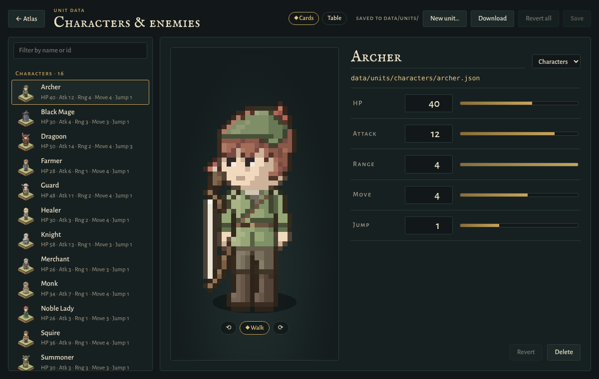
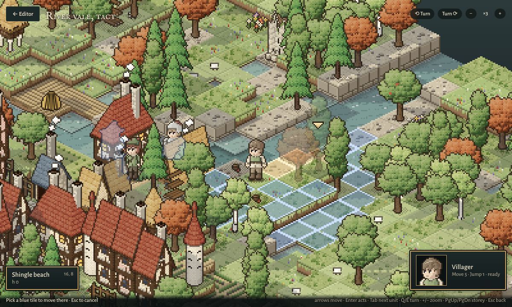
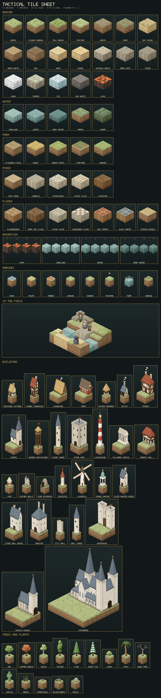
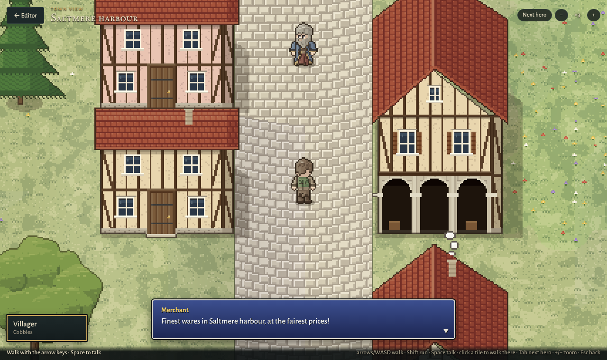
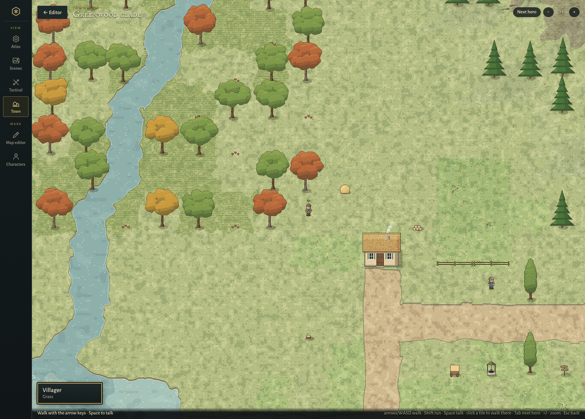

# Hexwright Atlas

A procedural, hand-drawn-style hex-map atlas. Give it a seed and it generates a fantasy realm
(terrain, rivers, roads, settlements, names) on a canvas, and lets you "enter" any city to see an
isometric district map.

## Moving between modules

A rail down the left edge (along the bottom on phones) holds every part of the app, on every page:

- **View:** **Atlas** (the realm map and its cities), **Scenes** (the bundled maps, each ready to open), **Tactical**
  and **Town** (the two play views, on the map editor's current map).
- **Make:** **Map editor** (the tile editor) and **Characters** (the character maker).
- **Data:** **Unit data** (`units.html`).

`Alt+1` to `Alt+7` jump straight to each. The module showing is kept in the address (`index.html#editor`,
`#tactical`, `#town`, `#characters`, `#scenes`), so a reload or a bookmark lands on it, and the rail on the unit
data page goes back to the atlas page with the module in the address. The back buttons inside each module still
step down one layer (tactical view to editor to atlas) and the rail follows them.

**Scenes** lists the maps in `scenes/` and the editor's walking-test fixture as cards, each with a picture drawn by
the editor's renderer, its size and figures, and what it is for. Its main button opens the map in the view it was
laid out for (the tactical view, the town view or the editor, from its `.scene.json`); **Edit map** opens it in
the editor instead. Opening a scene replaces the editor's map; **Undo** brings the previous one back.

## Tile editor

The **Map editor** in the rail opens an isometric workbench built on the same tile set as the city
districts. Paint 34 kinds of ground, raise and lower terrain, place buildings, props, plants, room pieces and furniture,
turn pieces (`R`) and the view (`[` `]`), undo with `Ctrl+Z`, and export PNG or JSON. **Generate**
builds a starting scene for one of six lands (river vale, island harbour, desert oasis, frozen fells,
fenland, ashlands). The land is kept calm: the main ground covers most of it with the others in a few broad patches,
heights rise in wide terraces, ponds, islets, plateaus and patches of only a few tiles are smoothed away, water
deepens with distance from the shore, and woods gather in groves with only the odd tree in the open. On the realm map, **Enter hex** in any hex's survey opens a tiled map of that hex,
generated from the atlas: its biome blended into its neighbours', coast or lake shore on the sides that touch
water, rivers and roads crossing the same sides as on the map, farmland, and the village, town, keep, ruin or
other feature that stands there (a city or abbey hex brings its whole city plan). Inside a city, **Enter
district** opens just the selected district. The map is autosaved in the browser.

### Interiors

The **Interior** tab holds room pieces and furniture, and the Terrain tab has a **Floors** group (floorboards,
dark oak, stone, a chequered floor, red and blue carpet, strewn rushes).

- **Room pieces:** an interior wall, a wall with a window, a doorway, a fireplace, stairs and a timber post. Walls are
  kept low, cut away like a dolls' house so the room stays visible, and they join the room pieces beside them
  into corners and tees. Characters can walk through a doorway; every other piece blocks them.
- **Furniture:** a bed, a straw cot, a table, a long table, a chair, a stool, a bench, a chest, a wardrobe, a
  bookshelf, a dresser, a writing desk, a counter, a cooking pot, a wash tub, a candle stand, a potted plant, a
  throne, an altar, a pew, a weapon rack and a spinning wheel. Each is drawn in its own frame, so `R` turns it
  to face any of the four ways and turning the view shows its back.

### Storeys

A map has a ground level and up to three floors above it. The **floor** switch in the bottom-left corner (a stack of 3, 2, 1 and G, or
`PgUp`/`PgDn`) chooses the storey you work on. Every tool acts on that storey, and the floors above it are
hidden so you can always see inside.

- **Laying floors:** on floors 1-3, **Paint** and **Fill** lay floor tiles in any terrain (floorboards,
  carpet and so on), and **Erase** takes up floor where no piece or character stands. A floor sits one storey
  (16 units) above the ground under it.
- **Furnishing:** pieces and characters belong to the storey they were placed on. They only collide with
  things on that storey, so a bedroom can sit directly over the kitchen.
- **Stairs:** the **Stairs** piece (Interior tab) joins two storeys. It rises towards its back, and a
  character on it steps off its top end onto the floor tile behind it, one storey up. Leave that tile's
  floor in place and take up the floor over the stairs for a stairwell. With **Walk**, clicking any reachable
  tile on any storey routes the character there, up and down stairs as needed. Clicking a flight of stairs
  sends the selected character up it (clicking them while they stand on a flight does too), and clicking the
  open stairwell from the floor above brings them down onto it. The floor switch follows the selected character
  to whichever storey they step onto.
- **Heights:** raising and lowering land works on the ground only. A floor follows the ground under it, so
  walking keeps the one-level step everywhere: on the ground, along a floor laid over a slope, and onto the
  landing at the top of a flight.

Saved maps include their floors, and maps without them save exactly as before. In the automation API, edits
and lookups take a `level` (`paint`, `fill`, `place`, `erase`, `moveObject`, `getTile`, `listObjects`,
`ascii`, `placeCharacter`, `walkCharacter` (which returns the route it took), `removeCharacter`). `removeFloor` takes floor up, and
`setView({ level })` switches the storey.

### Characters

The **Characters** tab lists the roster: twenty-two pixel-art figures, 32×48 and big-headed, in the manner of
Final Fantasy Tactics and Tactics Ogre.

- **Townsfolk:** a villager in an open vest over a laced shirt, a farmer in rolled sleeves and overalls, a guard with a kettle helm, cape and
  spear, a bearded merchant in a long gold-faced coat with a sash and a satchel, a hooded monk with a rope belt, a healer with a satchel marked with a
  cross, and a red-haired noble lady in a green gown and gold circlet.
- **Jobs:** squire, knight, archer, thief, dragoon, valkyrie, black mage, white mage and summoner.
- **Enemies:** a big-eared goblin with a nail-studded club, a hooded and masked bandit, a tusked orc with war paint
  and a great axe, a skeleton with a rusted sword, a grey wolf that trots on four legs, and a round slime that heaves.

Each character faces four ways, standing or walking, and is painted in the tile set's own soft palette and
outlined in the tiles' ink. On the map every zoom draws from one master per frame, rendered at 8× with each sprite
pixel a crisp square and pre-shrunk in halving steps. So a figure keeps its pixel art up close and stays clean
zoomed out. A figure stands about as tall as a cottage's eaves.

Movement is by clicking. Pick a character and click a free tile with **Person** (`C`) to stand it there (`R`
turns it). With **Walk** (`W`), click a character, then click a tile. The ground it can reach is tinted, the
route to the tile under the pointer is traced, and it walks the shortest way there, its arms swinging with its
strides. Clicking a character with Person also picks it up for walking. A tile is free when it is dry, not lava,
and holds neither a piece nor another character; a step may climb or drop one height level at most. Characters
walk behind and in front of buildings correctly, and are on the same undo stack as every other edit.

**New character…** opens the **character maker**. A character is built from choices:

- **Body:** build, clothes, sleeves.
- **Head:** hair, hat, beard.
- **Gear:** what they hold, a shield, a cape, a satchel.

Each material gets a colour from the tile set's swatches or any colour. The preview walks the character in all four
facings. Characters can start from any of the townsfolk, and **Edit…** changes a made one or a copy of a
townsperson. Made characters save to your character library in the browser as you go, appear under **Made here**,
and travel inside any map they stand on.

The map JSON names each character by its id. Maps saved with the first, hand-painted character style still
open: their starters come back as the same people in this style, and characters painted in the old sprite editor
come back as villagers. The automation API has `listSprites`, `makeCharacter`, `listCharacters`,
`placeCharacter`, `walkCharacter` and `removeCharacter`. See [docs/character-design.md](docs/character-design.md).

### Character sprite sheet

`src/characters/` draws the roster in plain Node, with no DOM.

- **Palette.** Each colour is picked from the tiles' own and washed toward their paper, then shaded in gentle steps
  and outlined in the tiles' umber ink.
- **Walking.** The arms swing with the legs. `docs/images/character-walk.png` shows everyone walking in all four
  facings.
- **Builds.** Bodies come in four builds (slim, standard, stocky, tall), cut from measurements, and anyone can be
  drawn in any build.

`npm run sheet` draws the sheet into `docs/images/character-sprite-sheet.png`, with every figure on the editor's grass
tile, and the walk into `docs/images/character-walk.png`. Add `--strips` for one 1× strip per character.


### Unit data

How each character and enemy plays lives in data files, one per unit, kept apart from how they look:

```
data/units/
  characters/  archer.json  blackmage.json  dragoon.json  ...  (the townsfolk and the jobs)
  enemies/     bandit.json  goblin.json  orc.json  skeleton.json  slime.json  wolf.json
```

A file is named by the unit's id, which is the id of the sprite it plays as, and holds its name, HP, Attack, Range
(how many tiles away it can strike), movement (Move: tiles a turn; Jump: height levels a step can climb or drop). `src/data/units.js`
defines the fields, their ranges and defaults, and normalizes and validates a unit; a sprite with no file, such
as a custom character from the maker, plays with the defaults. The tactical view moves units by their Move and
Jump and shows their HP, Attack and Range; adding a field means adding a line to `FIELDS` there.

**Unit data** in the module rail opens `units.html`, an editor for these files:

- **Cards:** the list of units down the side, filterable, and a card for the picked one: its sprite walking (turn
  it with ⟲ ⟳), name and group, and HP, Attack, Range, Move and Jump listed on the right, each with a bar against the strongest unit.
  Changed values are outlined in brass.
- **Table:** everyone in one sortable grid for balancing numbers side by side, every cell editable.
- **Saving:** changes are drafts until **Save** (`Ctrl+S`), which on the dev server (`npm run dev`) writes the
  files through the Hexwright bridge: `PUT` and `DELETE /__hexwright/units/<group>/<id>`, `GET /__hexwright/units`.
  Every write is normalized, so the files keep one shape. A tactical view open in another tab picks the new
  numbers up straight away. **New unit…** gives a sprite without a unit its own file, starting from the defaults
  or a copy of another unit; moving a unit to the other group moves its file. The built site (GitHub Pages)
  shows the same data read-only, with **Download** for a unit's file.



### Tactical view

**Tactical** in the module rail (or `T` in the editor) shows the map through a close-up camera like the old tactics games (Final
Fantasy Tactics, Tactics Ogre): pixel art at whole-pixel zoom (×1 to ×6, about a dozen tiles across by default),
with the camera gliding after the cursor and the unit on the move.

- **Moving units:** click a unit (or press `Tab`) and the tiles it can reach light up in blue, by its own Move and
  Jump from its [unit data](#unit-data) and the editor's walking rules (no more height levels a step than its Jump, around pieces, up and down stairs). The route to the tile
  under the cursor is traced in gold. Click a blue tile (or press `Enter`) and the unit walks there, hopping up
  and down ledges, one stride to a tile at 4.2 tiles a second (8.4 with the ▶▶ 2× chip or F), so the arms swing at the pace the figure moves. The
  camera sits on whole art pixels and rides along the walker's path on the ground (not its hops), holding the
  walker still on screen while the ground scrolls under it. Moves are map edits, on the editor's undo stack.
- **Camera:** the arrow keys or `WASD` step the cursor along the grid and the camera keeps it in view. Drag to
  pan, scroll or `+`/`-` to zoom, `Q`/`E` to turn the view, `PgUp`/`PgDn` to change storey, `Esc` to go back.
  Pieces standing in front of the unit in play or the cursor fade so neither is lost behind them.
- **Panels:** the tile under the cursor (ground, piece, height, storey) and the unit's portrait and stats.
- **Figures:** units are drawn at three quarters of their sprite size, about 30 pixels tall, a little under a
  tile's width. The shrink is done on the sprite's materials before its light and outline are worked out, so it
  stays crisp pixel art with its face intact (`renderScaled` in `characters/roster.js`).
- **Depth:**
  - **Cast shadows:** light comes from the left. Cliffs, walls and buildings throw shadows across the ground to
    their right, and trees throw short ones. Shadow edges follow the ground at a third of a tile.
  - **Occlusion:** ground at the foot of a higher cliff darkens along the edge that meets it.
  - **Elevation:** low ground is a shade darker and high ground a shade lighter, so heights read across a field.
  - **Silhouettes:** a unit hidden behind a building, cliff or tree shows through as an outlined silhouette.
  - **Ordering:** a unit beside a long or wide building is drawn on the correct side of it. It is tested against
    the building's edges, not its centre.

`src/tactical/` holds it:

- **Tile sheet** (`tiles.js`, no DOM). Every ground in the tile set redrawn as pixel art at the characters' scale:
  a 2:1 diamond 32 wide and 16 tall whose rows tile with no gap or overlap, 8 pixels of cliff to a height level,
  so a 32×48 figure stands on it 1:1. Each ground keeps its tile's colours as a five-step ramp and its marks
  (tufts, flowers, furrows, cobbles, boards, carpet borders, ripples) redrawn as pixels, in four variants.
  Cliff faces hang in the tile's two side colours with wandering strata (earth), coursed blocks (stone) or beams
  (wood), and grassy grounds hang a lip over the edge. Water and lava have four frames, and water foams where it
  meets land. Markers: move range, route, target, a two-frame cursor, a pointer and a unit's shadow.
- **Buildings, trees and plants** (`buildings.js`, `foliage.js`, no DOM). Every building and every piece of nature
  in the tile set redesigned as pixel art for the close camera, at the figures' own scale, rather than shrunk
  from the editor's drawings. Each keeps its editor self with the detail a close view can show:
  - **Walls:** plaster with timber framing and braces, coursed ashlar with quoins at the corners, rubble,
    boards and logs.
  - **Openings:** windows with frames, mullions, sills, shutters and a glint on the glass (lit at the tavern),
    and plank doors with hinges and a latch, arched in stone walls.
  - **Roofs and tops:** thatch laid in courses with a stitched ridge and ragged eave, clay tiles, slates,
    shingles and copper; chimneys with caps and smoke; flags, battlements, spires and crosses.
  - **Trees:** broadleaf crowns are lit masses broken into leaf clumps on barked trunks. Pines are drooping
    tiers of needles; the snowy fir has snow along each tier.
  - **Other nature:** palm, dead tree, cactus, reeds, toadstools, wildflowers and rocks.
- **Forge** (`forge.js`, no DOM). The small renderer they are built on: triangles, quads, turned surfaces and
  rounded masses, a depth buffer, per-pixel material shaders over five-step ramps with ordered dithering, and
  finishing that inks the outline and draws a contour wherever one part stands in front of another.
- **Scene** (`scene.js`, no DOM). A map as one back-to-front list of tiles, floors and pieces, each a few sprites
  at art-pixel positions, with figures slotted in by the same depth key. Pieces stand taller than on the editor's
  map, so a cottage is about a figure's height (tall buildings are lifted less, stairs not at all).
- **Renderer** (`render.js`). Draws only what is on screen, at whole device pixels with no smoothing. Buildings,
  trees and plants come from their designs. The smaller props and the furniture are the tile set's own drawings,
  drawn once at one unit to the pixel and finished as pixel art (hard edges, a small palette, an inked rim,
  a dithered contact shadow).
- **Move range** (`move.js`, no DOM) and the screen itself (`view.js`).

`npm run tactical-sheet` draws the sheet into `docs/images/tactical-tile-sheet.png`. Add `--atlas` for the packed
atlas, `docs/images/tactical-tiles.png`: one row per ground of 32×22 cells (the four variants, the three extra
frames of an animated ground, then a left and right face two levels deep), with the cell map in
`docs/images/tactical-tiles.json`. The sheet also shows every designed building, tree and plant.





### Town view

**Town** in the module rail (or `O` in the editor) walks the map the way the old town RPGs do (Final Fantasy VI, Dragon Quest, Pokémon):
seen from above and the south on square 96-pixel tiles (about six figures across), with the ground painted as one
solid surface rather than a grid of blocks. Houses fill their tiles at the figures' scale: a door a little taller
than a person, a cottage about twice their height, two-storey houses towering over the street.

- **Solid ground:** every mark (grass tufts, flowers, cobbles, boards, ripples) is laid out in map pixels, so a
  ground runs across tile edges without a seam. Where soft grounds meet (grass, a dirt road, sand, the sea) the border
  wanders on a smooth noise instead of following the grid (a road only gently); paving, floors and fields keep
  straight edges, and paving and roads climb slopes along their length only, so their courses stay straight. The
  higher-ranked ground is inked along its edge and shades the lower one: grass overhangs a path, and the shore shows
  a strip of bank and a line of foam on the water. Water takes its shape from the tiles round it rather than their
  squares, and a chain of water tiles (diagonal steps too) flows as one smooth river. Water and lava ripple.
- **Heights:** height is one continuous surface, 14 pixels up per level, drawn column by column from the south like
  a height-field. Between tiles one level apart (a step anyone can walk) the ground rises in a smooth slope, lit
  where it faces the upper left and shaded where it turns away. Only a jump of two levels or more (where no one can
  walk) breaks into a cliff, its edge wandering like any other border: earth or rock under a ragged grass lip,
  coursed blocks under paving, beams under floors, falling water. Cliffs throw a shadow east and darken the ground at
  their foot. Upper floors that are shown join the surface a storey up.
- **Camera:** it follows the hero's place on the ground and, through a gentle smoothing, their height, so climbing a
  ramp or slope never shakes the view.
- **Depth:** every screen pixel of ground remembers which row of the map it shows. A piece or figure is cut away
  wherever the ground shown there lies in front of where it stands, so a rise or cliff hides exactly what is behind
  it, and figures walking up a slope follow the ground.
- **Pieces:** every building, prop, plant and piece of furniture is redrawn front-on. A house fills its own
  footprint, wider than it is tall, seen from the south and a little east: a front wall (plaster, timber framing,
  ashlar, planks) with its east wall receding beside it in shade, both on a stone plinth; a door set back in its
  frame with iron straps, a ring handle and a step, with windows placed symmetrically round it, each set back into
  the wall: the reveal shading the glass along its top and west edge, glazing bars with hairline shadows, the sky
  reflected in the upper panes, a lintel above, a projecting sill with its shadow on the wall, and board shutters
  casting thin shadows; and above, a thatch, clay tile, slate or shingle roof, square along every edge, with a
  capped ridge, a thick eave, its east end in shade, and pale stone chimneys with overhanging caps, a faint shadow on the
  roof and soft smoke. Timber framing shows on the front only: beams three pixels thick standing proud of the wall (lit
  along their tops and west edges, grained, dark underneath), each casting a shadow into the lime-washed plaster
  panels, while the plain shaded east wall keeps the house's depth. Clay tiles are curved, each course shading the
  one below. Roofs keep one pitch, about four tenths of
  the house's depth (steeper for thatch), with the wall fitted below; a two-storey house on one tile takes a lower
  pitch so both storeys keep their full height. So a row of houses never
  covers the fronts of the row behind it; only towers, keeps and spires stand up over the tiles to their north. Round
  towers carry cones or battlements, trees are crowns of rounded leaf clumps, flatly lit (a sunlit band
  along each clump's top, shade along its underside, a soft rim where it stands over the one behind) on tapered
  trunks with roots, standing a little off the grid so a wood never grows in rows,
  pines are tiers of slanting needles with drooping tips, and props and furniture keep the figures' scale in the
  middle of their tiles. Shadows fall to the east. City and room walls join their neighbours. A piece standing in
  front of the hero fades so they are never lost behind it.
- **Walking:** the hero walks freely, not tile by tile: the arrow keys or `WASD` (diagonals too, `Shift` runs) move
  them at a figure's pace, about three of their own heights a second, with a stride every few pixels so the feet plant
  instead of gliding. Clicking a tile walks them there along the editor's walking route, up and down stairs. Only the
  storeys up to the hero's own are shown, so stepping indoors upstairs takes the roof off. `Tab` (or **Next hero**)
  walks as the next character. Everyone else strolls about near where they were put; enemies hold their ground.
- **Collision:** each piece blocks only the ground it is drawn standing on: a tree its trunk, a bush, well or
  haystack its round base, a house its walls (the doorstep stays open), a fence a strip along its rails, an interior
  wall its band, joined to its neighbours. Flowers, toadstools, reeds, doorways and stairs block nothing. Water stops
  the hero exactly at its painted edge, a cliff wherever the ground jumps two levels or more, and other walkers by a
  small circle round their feet. Blocked one way, the hero slides along the other and eases round trunks and corners
  (`src/town/collide.js`).
- **Talking:** `Space` or `Enter` talks to whoever the hero faces (they turn to answer, in a slate and gold window with their portrait, like the tactical view's),
  or looks at the piece or water in front of them. Clicking a character walks up to them and talks.
- **Phones and tablets:** a finger dragged anywhere on the map is a stick the hero walks by (a small pull strolls,
  pulled further they run, and the stick follows a finger dragged past it); a tap walks them to the spot or up to
  whoever is there, a tap on the hero or the **Talk** button talks, a tap closes what was said, and two fingers pinch
  the zoom. The page under the view never pans, zooms or selects text.
- **Sharp and smooth:** the canvas has one pixel per device pixel and every art pixel is a whole number of them, so
  the pixel art never smears or shimmers at any screen density; the camera and walkers move to the nearest device
  pixel, so they glide rather than stepping an art pixel at a time. The ground is painted in workers ahead of the
  camera, nearest first, so walking never waits on a new piece of ground coming into view.
- **A stroll, not an edit:** the town view walks a copy of the map, so nothing it does changes the map or its undo
  history, and it starts afresh each time it is opened.

`src/town/` holds it: `ground.js` builds the height surface and paints it in 128-pixel chunks with their depth
buffers (no DOM), `ground-worker.js` runs that painting in a worker, `pieces.js` draws the pieces (no DOM), `talk.js` holds the lines, and `view.js` is the screen. `scenes/town/saltmere-harbour.html` opens straight
in it.





### Test scenes

`scenes/` holds self-contained HTML test pages. Each one is the whole app inlined into a single file that
opens straight from disk, with no server. It has a tile map preloaded in the editor and a panel of walking
checks that run on load. `scenes/hillside-tower.html` is the hillside scene: a terrace reached by one ramp
tile, a three-level tower joined by two flights of stairs, a summit ringed by cliffs, and a two-storey house.

- **Checking routes:** each check walks a character through the automation API and audits the route. Every
  step must be one tile and at most one height level of climb, and storeys may only change on stairs. The page
  shows pass or fail, with the route's step count, heights and storey changes. **Re-run** repeats the checks,
  and clicking a check replays that walk on screen.
- **Scripted browsers:** results are in `window.__sceneResults`.
- **Editor, tactical and town views:** every scene page has all three. The panel's **Editor**, **Tactical** and
  **Town** buttons switch between them, and what is edited in the editor shows in the tactical view when it is opened again.
- **Tactical scenes:** `scenes/tactical/` holds pages that open straight in the tactical view.
  `scenes/tactical/scale-study.html` stands every kind of house, tower and tree on a flat green, with a figure in
  front of each, to judge their sizes against each other. Its map is `scenes/tactical/scale-study.json`, and
  `scale-study.scene.json` beside it gives the title, notes and the camera (`view: "tactical"`,
  `tactical: { zoom, center }`); a scene with nothing to check needs no checks file.
  `scenes/town/saltmere-harbour.html` opens in the town view (`view: "town"`, `town: { zoom, hero }`), an island
  harbour town to walk about in. `scenes/town/greenwood-glade.html` shows off the trees and plants: an oak grove with
  copper beeches, a birch copse on the heath, a poplar avenue, pines climbing a hill to snowy firs, and a reed-fringed
  pond fed by a stream, round a woodcutter's cottage. Its map is built by `node tools/make-greenwood.mjs`.
  `scenes/tactical/market-day.html` is a village market square on market day: merchants at their stalls,
  villagers round the well and farmers in the wheat and by the hay cart, in several facings so the backs of their
  clothes show, with the dragoon and the black mage beside them as the benchmark.
- **Rebuilding:** run `npm run scene -- <map.json> [out.html]` to rebuild a page from a saved map
  (`npm run scene -- scenes/tactical/scale-study.json scenes/tactical/scale-study.html` for the scale study). The checks
  come from a `<map>.checks.json` beside it, if there is one; see `src/editor/fixtures/hillside-tower.checks.json`
  for the format. The same scene is replayed by `src/editor/scene.test.js` under `npm test`.

## Automation API and MCP server

The tile editor can be driven without a mouse or Playwright. Three layers share one method list
(`src/editor/api-spec.js`):

1. **In the page**: `window.hexwright.call(method, params)` (also `hexwright.paint(...)` and so on). It
   works in the dev server, a preview build and the deployed site, and edits land on the editor's own
   undo stack through the same operations (`src/editor/ops.js`) the mouse tools use.
2. **HTTP, under `npm run dev`**: a Vite plugin (`tools/vite-hexwright.js`) relays calls to the browser
   page that has the editor open.

   ```
   GET  /__hexwright/pages            connected editor pages
   GET  /__hexwright/spec             every method with its JSON schema
   POST /__hexwright/api/<method>     body = params -> { ok, result } | { ok: false, error }
   ```

   ```sh
   curl -s -XPOST localhost:5173/__hexwright/api/paint -d '{"terrain":"sand","rect":{"x":2,"y":2,"w":4,"h":3}}'
   ```
3. **MCP server** (`mcp/server.mjs`, registered in `.mcp.json`): one `hexwright_<method>` tool per method.
   It uses the dev server at `HEXWRIGHT_URL`, else one already on port 5173 (`127.0.0.1` or `[::1]`, preferring
   the one with an editor page attached), else it starts Vite on a free port. Which browser hosts the page is
   set by `HEXWRIGHT_BROWSER` (in `.mcp.json` `env`) or a `--browser=<mode>` argument:

   | Mode       | Behaviour |
   | ---------- | --------- |
   | `auto`     | Default. Drives the editor tab you have open; with none, starts a headless Chromium. |
   | `browser`  | Only your own browser: edits appear live in your tab. Never launches Chromium (`none` is an alias). |
   | `headless` | Always a private headless Chromium; calls go only to its page, never to your tabs. |

   `HEXWRIGHT_HEADED=1` shows the launched window, `HEXWRIGHT_CHROME` points at a specific binary. The browser
   only hosts the page; no clicks are scripted. Headless needs a Chromium: `npx playwright-core install chromium`.

Methods, all in model tile coordinates (x east, y south):

| Group    | Methods |
| -------- | ------- |
| Discover | `describe` (terrain, assets, biomes, limits), `state`, `ascii` (text map), `getTile`, `getRegion`, `listObjects`, `listSprites`, `listCharacters`, `getMap` |
| Edit     | `paint`, `fill`, `elevation`, `place`, `erase`, `moveObject`, `removeFloor`, `placeCharacter`, `walkCharacter`, `removeCharacter`, `useTool` (a drag path), `batch` (atomic, one undo step), `rename` |
| Map      | `newMap`, `generate`, `setMap`, `undo`, `redo` |
| View     | `open`, `close`, `setView` (rotation, zoom, centre, grid), `setSelection`, `tileToScreen`, `screenToTile` |
| See      | `screenshot` (`map`: offscreen render at any scale, rotation or tile crop; `viewport`: the on-screen canvas) |

Bad ids and ranges are rejected with a message that names the problem (`unknown terrain "sandd". Did you
mean sand?`), unknown parameter names are rejected, and a placement that does not fit returns
`{ placed: false, reason }` instead of failing silently.

`npm test` runs the unit tests for the pure operations. `npm run test:e2e` drives the whole chain
(MCP client, server, dev server, headless Chromium) and needs a Chromium: set `PLAYWRIGHT_BROWSERS_PATH`
or run `npx playwright-core install chromium`. `E2E_OUT=<dir>` saves the screenshots it takes.

`npm run perf` (after `npm run build`) clicks through the tile editor's tools on a 48×48 map in
headless Chromium and reads the browser's Event Timing entries, the numbers Interaction to Next Paint
is built from. It fails when an interaction's p75 latency passes 200 ms, or when the map image the
editor patched in place after those edits differs by a single pixel from a full render. CI runs it on
every pull request. `PERF_BUDGET_MS`, `PERF_SIZE` and `PERF_CPU_THROTTLE` adjust it.

## Scripts

| Command           | What it does                    |
| ----------------- | ------------------------------- |
| `npm install`     | Install dependencies            |
| `npm run dev`     | Start the Vite dev server       |
| `npm run build`   | Production build into `dist/`   |
| `npm run preview` | Serve the production build      |
| `npm run lint`    | Lint `src/`, `tools/`, `mcp/`   |
| `npm run scene -- <map.json>` | Build a self-contained HTML test page for a scene into `scenes/` |
| `npm run sheet`   | Draw the character sprite sheet and walk into `docs/images/` |
| `npm run tactical-sheet` | Draw the tactical tile sheet (and with `--atlas` the tile atlas) into `docs/images/` |
| `npm test`        | Unit tests (no browser needed)  |
| `npm run test:e2e`| MCP end-to-end test (Chromium)  |
| `npm run perf`    | Editor latency budget (Chromium)|
| `npm run mcp`     | Run the MCP server on stdio     |

Requires Node 18+.

## CI and hosting

`.github/workflows/ci.yml` lints and builds every pull request and every push to `main`. Pushes to
`main` also publish `dist/` to GitHub Pages at <https://shuyi56.github.io/hexwright-atlas/>. Pages
must be set to **Source: GitHub Actions** once, under the repository's Settings → Pages.

## Layout

```
index.html            App shell (markup + font links)
src/
  main.js             Boot: wires up the app and loads the first realm
  styles/main.css     All styles
  core/               Hex geometry, seeded RNG + noise, name generators
  world/              Biome data and the realm generator (terrain, rivers, settlements)
  render/             Canvas painting of the realm map
                      (relief, trees, terrain, settlements, rivers/roads, base compositor)
  city/               City districts: generation, architecture solids, 2.5D rendering
  tiles/              Shared isometric tile set: terrain tiles, buildings, props and nature,
                      drawn procedurally with a small iso kit (used by the city view and the editor)
  characters/         Characters: pixel engine, body builds, shared parts, the townsfolk and the jobs, drawing
                      them on the map, the sprite sheet layout and its pixel font
  data/               Unit data: the fields and ranges of a unit's stats, and the registry the game reads
  units/              The unit data page (units.html)
  tactical/           Tactical view: the pixel tile sheet, the scene as a depth-sorted sprite list, the
                      whole-pixel renderer, move ranges and the close-up camera screen
  town/               Town view: the painted height surface with its slopes, cliffs and depth buffer, the
                      front-on pieces, townsfolk's lines and the walking screen
  editor/             Tile editor: map model, pure ops, renderer, scene generator, city and hex import, UI,
                      automation API (api-spec, api, bridge)
tools/                Vite plugin that relays HTTP calls to the editor page and saves unit data (dev server only),
                      the character sheet writer and a minimal PNG and APNG encoder
data/units/           One JSON file per character and enemy: HP, Attack, Range, Move, Jump
mcp/                  MCP server, backend launcher and end-to-end test
  ui/                 Shared state, map drawing, view/pan/zoom, input, ledger panel, city view, the module
                      rail (rail.js) and the shell that moves between modules and lists the scenes (shell.js)
legacy/               The original single-file artifact, kept for reference
```

`src/ui/state.js` holds the mutable view state (`state.z`, `state.ox`, `state.map`, ...) that the
UI modules share.
