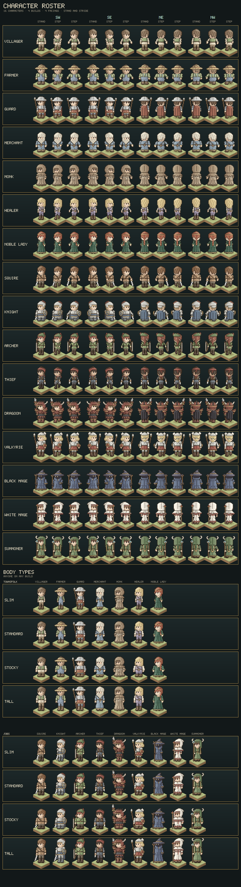
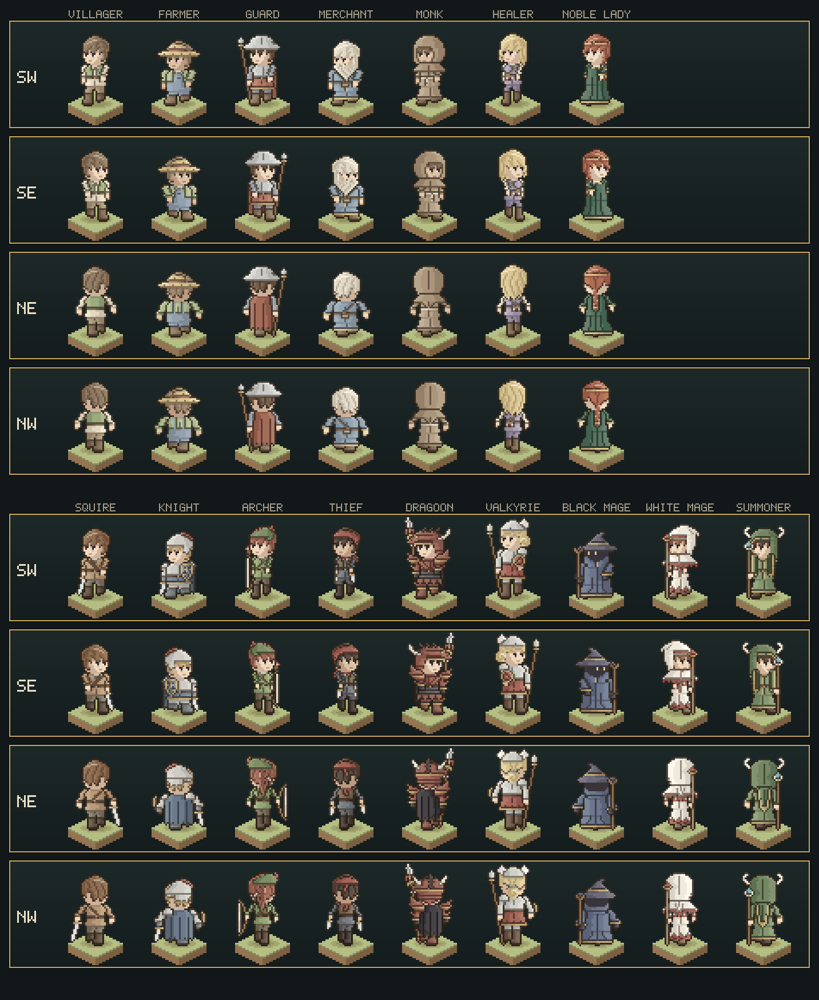

# Characters

The people who stand and walk on the tile editor's maps. The style follows the squad tacticians of the 1990s,
Final Fantasy Tactics and Tactics Ogre: chunky, big-headed figures that read by silhouette across a map. They are
painted in the tile set's own soft, chalky palette with gently hue-shifted ramps and an outline in the tiles' umber
ink, so they belong on the editor's ground. The code lives in `src/characters/`.

The roster is sixteen characters: seven townsfolk, the people of the map's towns and villages, and nine jobs.
The character maker makes more from the same choices the townsfolk are built from.





## The roster

Each character has a default build (in brackets below); anyone can be drawn in any of the four.

| Townsfolk | Read at a glance by |
| --- | --- |
| Villager (standard) | Short brown hair, a cream linen shirt under an open green vest, tan trousers. |
| Farmer (stocky) | A straw hat with a flat crown and a red band, a green shirt, blue bib-and-brace overalls with buckled braces and a pocket. |
| Guard (standard) | A kettle helm with a comb and a turned-down brim, a steel breastplate over a red tunic, mail sleeves, a spear and a red cape. |
| Merchant (stocky) | White hair and a full white beard falling to a point, a long blue robe edged in gold, a satchel on a strap. |
| Monk (standard) | A deep plain cowl with the face in its shadow, a capelet over the shoulders, a robe of undyed wool to the floor with bell sleeves, tied with a rope whose end hangs. |
| Healer (slim) | Long fair hair, a lilac tunic over white sleeves, a white satchel marked with a red cross. |
| Noble Lady (slim) | A red braid over her shoulder, a gold circlet with a jewel, a green gown to the floor with a square neckline, bell sleeves and a gold hem. |

| Job | Read at a glance by |
| --- | --- |
| Squire (standard) | Short hair, a tan padded jerkin with a cross-strap, a sword held point-down. The plain starting job. |
| Knight (stocky) | A plumed helm, plate with pauldrons, a blue tunic skirt, a kite shield with a gold cross, a long blue cloak behind. |
| Archer (slim) | A green feathered cap, an auburn ponytail down her back, a quiver slung across her back, a recurved longbow held at her side. |
| Thief (slim) | A red bandana with trailing knot, a red scarf, a dark leather vest over slate, a dagger in each hand. |
| Dragoon (standard) | Crimson plate spiked from crest to sabaton: a dragon helm with a jutting snout, fangs and an amber eye, a crest of black iron spikes and a bone horn; spiked pauldrons, couters and knee cops; pointed tassets; a black cape dagged into points; a winged lance with a gold tuft. |
| Valkyrie (tall) | A winged silver helm, gold hair in a low braided bun, plate over crimson skirts, a spear and a round buckler. |
| Black Mage (stocky) | A wide-brimmed pointed hat with a flopped tip, a face of pure shadow with two glowing eyes over a high collar, a floor-length blue robe flaring to a gold hem with only his toes beneath, wide bell sleeves, a crooked staff. |
| White Mage (slim) | A white cowl whose peak droops back like a nightcap, a red band framing her face, a mantle and robe hemmed in red teeth, a staff with a red orb in a gold cup. |
| Summoner (standard) | A moss-green cowl banded in gold with a jewel at the brow, ram's horns curling from its temples, gold-edged lappets down her chest and a long tail down her back; a rod with a blue crystal in bone claws. |

## Format

- **Frame.** 32×48 pixels. Every build stands with its soles on row 46, so figures line up on a battlefield;
  the rows above the tallest head leave room for plumes, horns and polearms.
- **Proportions.** The head is 14 pixels wide on every build and about as tall as the torso: roughly three
  heads to the figure, the squat, readable build of the genre.
- **Facings.** Two are drawn: front (south-west, three-quarters on, the face to the viewer's left) and back
  (north-east). South-east and north-west are mirror images, as in the games. Both drawn views keep the near
  shoulder on the right, so a weapon in the right hand is on the far side from the front and the near side from
  behind, and a shield on the left arm the other way round.
- **Poses.** Standing and two strides. In a stride the body drops a pixel, one leg reaches forward and the other
  lifts its heel, and each arm swings against its leg; held weapons and shields move with their hand. Played
  stride, standing, the other stride, standing, they make a four-beat walk (see Walking below).

## Body types

Four builds, set by a handful of measurements in `body.js` (`BODY_TYPES`):

| Build | Torso, legs (rows) | Shoulders, waist (px) | Legs, arms (px wide) | Height over standard |
| --- | --- | --- | --- | --- |
| Slim | 12, 13 | 10, 8 | 3, 2 | +1 |
| Standard | 12, 12 | 12, 10 | 4, 3 | 0 |
| Stocky | 12, 9 | 14, 13 | 5, 4 | −3 |
| Tall | 14, 15 | 13, 11 | 4, 3 | +5 |

- **Generated body.** The torso, arms, legs, robe skirts, gowns and cloaks are cut from these numbers rather than
  drawn as fixed grids. Clothing is a set of rules over the cut shape. Some follow the cut: where the collar, belt,
  breastplate ridge or robe panel falls, or a vandyked robe hem. Others are added on as outfit options: an open
  vest, a strap from shoulder to hip with a satchel at its end (`satchel`), a skirt carried below the hem, bib-and-
  brace overalls (`bib`), a square neckline (`neckline`), and a rope belt's hanging end (`cord`).
- **Hung on landmarks.** The hand-drawn parts (heads, hair, hats, hoods, quivers, scarves, pauldrons, weapons,
  shields) were drawn once, against the standard build. Each hangs on a landmark: the head, the neck, a
  shoulder or a hand. It moves with that landmark on any other build.
- **Weapons.** Each weapon is made for the fist that holds it (see Weapons below), so it fits any build and
  pose.

`render(character, build)` draws anyone in any build; `render(character)` uses their own.

## Arms

- **Shape.** Each arm hangs from a fixed shoulder: a rounded cap, the upper arm overlapping the torso's edge by
  one column, an elbow where it steps a pixel further out, the forearm, a cuff and a fist. The fist's thumb is
  on the side the figure faces. A slim build has two-pixel arms and fists.
- **Reading as limbs.** The arm sits in front of the body as its own piece, so it gets a contour line. Below
  the elbow a gap opens between forearm and waist. Both hands hang clear of the body on every build.
- **Swing.** See Walking below. The shoulder only rides down with the body. An arm carrying a staff or polearm
  stays upright and does not swing.
- **Materials.** Gauntlets take their own darker steel (`D`) against plate sleeves.

## Walking

The arms walk with the legs. In each stride every free arm swings from its shoulder like a pendulum, against the leg
on its side: in the first stride the far leg steps forward and the near arm leads; in the second, the other way
round.

- **Leading arm.** It leans forward, toward the facing, a little more each row from the shoulder cap down, until its
  hand is three pixels ahead and two rows up: the arm rises as it leaves the vertical, and its hand rises even
  though the body drops.
- **Trailing arm.** It leans back until its hand is two pixels behind and a row up.
- **In three-quarter view.** Forward is left on screen in the front view and right from behind. So in front the
  leading near arm crosses before the body, and on the next stride the near arm swings out behind while the far arm
  swings out ahead. A far arm swinging in behind the body moves only a pixel, since it is turning away from the
  viewer, and so a sword or dagger in that hand stays in sight.
- **What moves with it.** Fists, held weapons, shields and sleeves go with the arm; a bow narrows its sweep if the
  swing would carry it out of the frame. Staves and polearms are held steady and planted, so that arm only bobs with
  the body.
- **The cycle.** `WALK` in `roster.js` is the order the frames play in: stride, upright, the other stride, upright.
  On the map a walking character plays one full cycle for every tile it crosses. `docs/images/character-walk.png`
  is the roster walking in place in all four facings, an animated PNG at 170 ms a beat.

## Robes

Two kinds of long garment, both cut from the build:

- **Robe** (merchant, white mage, summoner). A tunic-cut bodice belted at the waist over a skirt to the ankles,
  with the shoes below it. The white mage's skirt is hemmed in red teeth.
- **Gown** (black mage, noble lady, monk). One garment from the shoulders to the floor with no belt and no waist. It hangs straight
  from the chest and flares from the lower chest in an A-line, its folds fanning out from the middle toward the
  hem. The robe's overlap runs down the front as a fold, and a seam runs down the back. The hem is trimmed in gold
  and rounds off at its corners, with only the toes showing beneath it. The sleeves are bell sleeves (`sleeves:
  { bell: true }`), widening below the elbow to a trimmed mouth with the gloved hand beneath. In a stride the hem
  swings: the leading foot kicks it forward, the back of it pulls in, and the lifted foot is hidden.
- **The monk's habit** is a gown tied at the waist with a rope girdle (`girdle`), knotted in front where its end
  hangs to a tassel (`cord`).
- **The noble lady's gown** adds a square neckline, the throat and chest bare above a gold edge with a jewel at
  its middle.
- **The black mage's collar.** A high collar stands up round his jaw and closes over his chin. His face is a band of
  shadow between the hat's brim and the collar, with the two eyes glowing out of it. From behind, the collar rises
  over the nape.

## Armour

The dragoon is armoured from crest to sabaton, and every piece ends in a point. The cut pieces are outfit options
in `body.js`, so they fit any build and pose. The rest are hand-drawn in `roster.js` and hang on landmarks.

- **Cuirass** (`torso: 'dragon'`). A gorget at the neck, then a breastplate ridged down the middle and cut with
  two chevrons that point down the ridge like overlapping scales. Below the belt is mail; behind, the same
  pattern runs about the spine.
- **Tassets** (`tassets: 3`). Plates hung below the hem over the thighs, four pixels to a plate, each cut down to a
  point.
- **Spiked sleeves** (`sleeves: { spike: true }`). A spike stands out and up from each elbow, and the gauntlet's
  cuff flares a pixel outward. The gauntlets are black iron (`D`) under brass cuffs.
- **Greaves** (`greaves: true`). The boots become plate. A knee cop stands forward of the knee, trimmed in gold
  along its lower edge, with a spike thrown forward and up from its point; the sabatons are drawn out to a
  pointed toe.
- **Dagged cape** (`cloak: 'dagged'`). A short cape cut along its hem into sharp points like a wing, its folds
  running down into them. From the front its edges and points show past the body and legs.
- **Helm.** A dragon's head. In front, the snout juts forward past the face to a point, with an amber eye at the
  stop and a nostril. Below it a gold-banded jaw hangs two bone fangs over the brow. A crest of black iron spikes
  sweeps back along the skull, a bone horn sweeps back from the temple and up, and a cheek guard runs down to a
  point. From behind, the crest runs down the middle as a spined ridge, horns curl up from both sides, and lames
  close over the nape.
- **Pauldrons.** Layered plates rimmed in gold, each thrown up into a spike: the near one rising beside the helm,
  the far one pointing up and out past the shoulder.
- **Colours.** Crimson-lacquered plate (`S`, close to the tiles' roof terracotta) with lighter greaves (`O`),
  over grey mail (`A`, `P`). The crest, gauntlets and cape are black iron (`D`, `V`), with brass trim, bone horns
  and fangs (`F`), an amber eye (`J`) and a gold tuft on the lance (`R`).

## Palette

The figures are painted to sit in the tile set's palette (see [render/palette.js](../src/render/palette.js) and
[tiles/terrain.js](../src/tiles/terrain.js)): pale, chalky colours on paper.

- **Colours from the tiles.** Each character's colours are picked from the tile set's own: the tiles' gold (`#c9a24f`) for
  every buckle, trim and hem; wax and roof reds, and the roofs' terracotta for the dragoon's plate; the slate of
  roofs and the carpet's dusty blue; the oak and pine greens; plank browns.
- **A wash toward the paper.** Before any shading, every colour loses over a quarter of its chroma and moves an eighth of
  the way toward the paper's lightness and warmth (`wash()` in `pixels.js`).
- **Gentle ramps.** The five shading steps are close together, like the tiles' lit and shaded faces. Highlights
  warm a little toward gold; shadows turn only slightly cool, so they stay in the tiles' warm family.
- **The tiles' ink.** The outline and every line inside the figure are mixed toward the tiles' umber ink (`INK`,
  `#2b2116`), and the inner lines are lighter than the outline, so the figures read as softly as the tiles.
- **Checked.** No pixel of any figure is more saturated than the tiles' gold, and each figure's average chroma
  stays well under it.

## Faces

Skin is cel-shaded as solid shapes rather than lit pixel by pixel, which had left faces mottled:

- **Two tones.** Uppercase `K` is one flat lit tone, lowercase `k` one shadow tone, both from the skin's ramp.
- **A drawn shadow.** The head grid places the shadow as a shape: the far cheek as the face turns from the light,
  the side of the nose, the underside of the jaw and the neck. Wherever hair, a brim or a hood hangs over the
  skin, the frame adds a one-pixel shadow band that follows its edge.
- **Features.** Each eye is a two-pixel lid over a pupil and its white, under a two-pixel brow; the mouth is a
  short dash. Hands take the same two tones, the fist's lower knuckles in shadow.

Skin is also never inked at its edges, so the face stays one clean shape and the hair or brim beside it carries
the line.

## Hair

Five hairstyles, all drawn in locks, front and back:

- **Short** (villager, farmer, guard, merchant, monk, squire, knight, thief, dragoon, white mage): a crown, a
  pointed fringe and points at the nape.
- **Long** (healer, summoner): falls behind the shoulders in vertical locks, its near lock beside the cheek.
- **Braid** (noble lady): the crown and fringe of long hair. In front the far side is tucked behind the ear and the
  near side is gathered into a braid over the near shoulder and down the chest. From behind every strand is drawn
  to the nape and plaited down the middle of the back. The plait is three pixels wide, in two-row lobes leaning
  alternately, each lit on its upper edge, tied off with a ribbon above a tuft.
- **Ponytail** (archer): the short crown and fringe, gathered at the back of the head with a leather band. In
  front the tail stays hidden behind the head; from behind it falls down the back, over the quiver.
- **Low bun** (valkyrie): a side-parted fringe swept back across the brow, the sides smoothed back behind the ear,
  and every strand drawn down to a round braided knot at the nape, tied with a blue band. In front the knot peeks
  out behind the head; from behind it sits at the nape. It keeps tight to the head on every build, clear of her
  spear on both sides.

A style may add a piece drawn over what is slung on the back (`over`, the ponytail over the quiver). The details:

- **Strand lines.** Each lock is parted from the next by a solid line in the hair's deepest tone (`Q`, the same
  as the brows). In front they sweep down toward the facing; from behind they fall from the crown.
- **Sheen.** An arc of light (`I`, the hair's highlight lifted toward warm white) runs across the crown on the
  upper left, where the light catches it.
- **Shape.** The fringe hangs in pointed locks over the brow, inked along its lower edge. Short hair ends in
  points at the nape; long hair falls behind the shoulders in vertical locks that end in points, its near lock
  hanging beside the cheek, clear of the eye.

Both marks come from the character's own hair colour, so the same grids serve every hair colour. Under helms, hats and
bandanas the hair still shows its locks where it is uncovered.

## Hoods

The hooded jobs wear two pieces: a fitted cowl over the head (the hat slot) and what falls from it over the
shoulders (the mantle slot, drawn over the arms, so the arms come out from under it).

- **White mage.** A rounded cowl whose peak droops off the back of the head like a nightcap. A red band frames
  the face over the cowl's shadowed lining and closes under the chin. A mantle slopes from the neck over the
  shoulders, closed with a gold clasp and hemmed in red teeth. From behind, a seam runs up the cowl and its peak
  trails down the back as a tail ending in red.
- **Monk.** A deep, plain cowl round the head. The face sits in the shadow of its lip, and it closes under the chin.
  A capelet falls over the shoulders. From behind, a seam runs up the cowl and its point hangs down the back.
- **Summoner.** A round cowl banded in gold at the brow, with a jewel at its centre. Ram's horns grow from its
  temples and curl up and back. Two gold-edged lappets hang down her chest to the belt, and from behind a long
  gold-edged tail falls to the small of the back.

## The townsfolk

The townsfolk (`townsfolk.js`) are the seven people of the first, hand-painted character style, redrawn in this one
with the same clothes, colours and props. Each is a spec: the same choices and colours the character maker offers
(below), so they are drawn like the jobs and the maker can start from any of them.

- **Hats.** The farmer's straw hat has a flat crown, a red band and a broad brim, with its weave picked out in
  creases. The guard's kettle helm is a round steel crown with a comb along its top and a broad brim turned down
  all round. The noble lady's circlet is a gold band round the brow with a jewel in front.
- **The merchant's beard.** A moustache over the mouth and sideburns joining the hair, then a full beard falling in
  locks to a point on the chest. His mouth still shows.
- **Satchels.** The merchant and the healer carry a bag (`U`) under a flap at the end of their strap. The healer's
  is marked with a red cross.
- **The guard's spear** is a plain leaf head on a socket. Like the valkyrie's, it is held in the hand and leans
  outward a pixel every five rows, and his arm keeps it steady.

## The character maker

New characters are made in the character maker, a screen over the tile editor. On the Characters tab,
**New character…** opens it on a new character. **Edit…** opens it on one already made, or on a copy of one of
the townsfolk. The jobs are drawn by hand, so the maker cannot make them.

- **Specs.** A made character is a spec (`custom.js`): a choice for each of build, clothes (shirt and vest, tunic,
  overalls, breastplate, belted robe, gown to the floor), sleeves (same cloth or a second colour; plain or bell),
  neckline and rope belt (for long clothes), hair, hat (straw hat, kettle helm, circlet, cowl, feathered cap,
  bandana, wizard hat), beard, what is held (sword, dagger, two daggers, spear, staff, bow), shield, cape and
  satchel. It also holds a colour for each material. `fromSpec()` turns it into a character built exactly like the
  jobs, wearing the headgear in `hats.js` and the gear in `parts.js`.
- **The screen.** Choices are rows of chips; a choice that means nothing with the current clothes (a neckline on a
  tunic) is hidden. Colours are rows for just the materials the character shows. Each is set from the tile set's
  swatches or with any colour. **Start from** sets every choice and colour from one of the townsfolk. The preview is
  the character in all four facings on grass, walking or standing. The maker also has undo and redo, duplicate
  and delete, and **Done** goes back to the map with the character ready to place.
- **The library.** Every change saves at once to the character library (`library.js`) in the browser. Made ids
  start with `custom-`, so they never shadow anyone in the roster. A character standing on the map cannot be
  deleted until it is taken off.

## Weapons

Weapons are made for the hand that holds them (`make({ hand, dir })` in `parts.js`): the fist's centre and its
outward side. So a weapon sits in the fist on any build and in any pose, and stays clear of the body.

- **Sword and dagger.** A crossguard under the fist and a two-pixel blade angling out from the body a pixel
  every three rows to a point, in its own bright steel (`Y`) so it never reads as more arm. The sword is ten rows
  long and the dagger three. The thief carries a dagger in each hand.
- **Lance** (the dragoon's). Carried at the ready: the shaft runs through the fist and its butt trails toward the
  ground behind the legs. Its point is at the top of the frame, and the head leans forward and out of the body as
  far as the frame allows (a pixel every four rows at most, steeper when the hand is near the edge), keeping a
  column spare for the outline. From the point down:
  - a long blade of bright steel (`Y`) with a ridge down its middle, narrowing at its neck;
  - two barbed wings swept back from its base, on a gold socket;
  - a tuft of horsehair splaying out beneath, in the job's accent (`R`);
  - a leather grip wound about the shaft either side of the fist;
  - a gold ferrule and a steel spike at the butt.
- **Bow.** Held by its leather grip, with the limbs sweeping outward to the tips and the string straight
  between them, all clear of the body.
- **Staves** (`staff()`: the guard's and valkyrie's spears and the mages' staves). A staff stands beside the fist with its foot
  on the ground on every build.
  - **Mages:** the staff stands upright and is held a little forward, drawn over the hood and mantle with the
    gripping fist drawn again over the shaft, so its head never hides behind headgear. Where its head would
    reach across the face (on a narrow build), it rides above the brow instead.
  - **Spears:** held in the hand like any weapon, so her hair covers the shaft. It leans outward a pixel
    every five rows through the fist, so the head rises clear of her hair in front and of the helm's wings behind.
- **Layering.** From behind, a weapon in the near hand is on the figure's far side, so the back, the hair and the
  arm all cover it.
- **Steady.** An arm carrying a staff or polearm stays upright and does not swing.

## How a sprite is made

Every part is a hand-drawn grid of material letters (`K` skin, `H` hair, `A` main cloth, `S` steel and so
on; the full list is at the top of `parts.js` and `roster.js`). Uppercase is the material as lit, lowercase
the same material in a crease: a fold, a seam, the line between two plates.

- **Body.** `body.js` cuts the torso (tunic, plate, robe, gown or the dragoon's cuirass), arms, legs (trousers,
  greaves, or a robe or gown skirt) and cloak (plain or dagged) for the build and pose, and reports the
  landmarks.
- **Shared parts.** `parts.js` holds the head, the five hairstyles, the skin tones and the gear: sword, dagger,
  lance, bow and a `staff()` maker for spears and staves, a kite shield and a buckler. `recolor()` swaps letters.
- **Characters.** `roster.js` (the jobs) and the specs (`custom.js`, the townsfolk and made characters, wearing
  `hats.js`) give each character a build, an outfit (torso and leg
  style, sleeves, gauntlets, vest, strap, satchel, overalls, neckline, girdle, cord, skirt, tassets, greaves, cloak), a
  palette, and parts in fixed slots, back to front: the cloak, things behind the body,
  the far arm, legs, torso, what is worn over it, head, hair, hat, the near arm, a mantle, a staff and the fist
  that grips it, and what the other hand holds. Jobs draw their own headgear and anything unique (the hoods, the
  archer's quiver, the black mage's shadow face, the dragoon's helm and pauldrons, the townsfolk's hats and the
  merchant's beard). `ROSTER` is everyone, townsfolk first, and `byId()` finds one.
- **Shading** (`pixels.js`). Each colour is washed toward the tiles' paper (see Palette), then becomes a five-step
  ramp in OKLCH, so pale and dark colours darken evenly. Highlights lean warm toward gold and shadows a touch cool.
  Each pixel's step comes from light at the upper left. The figure turns like a cylinder across its width, tops facing the sky catch light, and
  anything tucked under hair, a brim or a belt falls into shade.
- **Line work.** Solid ink throughout, in strengths set by `INK` in `pixels.js`:
  - **Outline:** the tiles' umber ink all round, only a touch warmer above and to the left where the light falls.
    Diagonal corners are left open so curves stay round.
  - **Contours:** where one part stands in front of another (an arm against the body), the part behind gets a
    dark line. The head, its hair and its hat count as one piece, as do a torso and what is worn over it.
  - **Edges:** within one piece, wherever a material ends against another below it or to its right, its last
    pixel is inked: the fringe against the brow, a brim against the face, a vest against the shirt, a plate
    against the tunic. A run only one pixel deep (a belt, a trim) keeps its colour. Skin is never inked at its
    edges, so faces stay clean and the hair or brim beside them carries the line.
  - **Creases:** lowercase letters (folds, seams, the ridge of a breastplate) are inked as lines rather than
    shaded.
- **Flat marks.** Eyes, the eye white, the black mage's shadow and his glowing eyes take no light, though they are
  washed like every other colour. So do the hair's strand lines and sheen (below).

## On the map

The tile editor draws these characters (`draw.js`, the one module here that needs a canvas).

- **Placing.** The Characters tab lists the townsfolk, the jobs and the characters made here, each standing on a
  grass block. Clicking one arms the Person tool.
- **Facings and walking.** A character faces any of four ways: the two drawn views, plus their mirror images. Walking
  plays the strides in `WALK` order, a full cycle to every tile crossed.
- **Every zoom.** Each frame becomes a master at 8×, every sprite pixel a crisp square, then is shrunk in halving
  steps. A zoom draws the smallest step that still has enough pixels, smoothed. So a figure keeps its pixel art up
  close, and never shimmers or aliases when zoomed out.
- **Size.** One sprite pixel is 0.3 drawing units, so a standing figure is about as tall as a cottage's eaves. Each
  casts the same soft shadow to the right as the pieces do.
- **Saving.** A saved map names each character by its id (`"sprite": "farmer"`). Every copy of the app can draw
  the roster. The specs of made characters standing on the map go with it (`customCharacters`); opened anywhere,
  they join that browser's library, keeping any it already has under the same id.
- **Older maps.** Maps saved with the first, hand-painted style named their people `starter-villager` and so on,
  and carried each sprite's pixels. They open with the same people in this style. Anyone else it cannot find (a
  character painted by hand in the old sprite editor, or a made one whose spec is missing) comes back as a
  villager, standing where they stood.
- **The automation API.** `listSprites` lists everyone (id, name, townsfolk, job or custom, build, and a made
  character's spec). `makeCharacter` makes a character from the maker's choices and colours, or changes a made one,
  and `placeCharacter` takes any id.

## Building it

```sh
npm run sheet                 # docs/images/character-sprite-sheet.png and docs/images/character-walk.png
npm run sheet -- --strips     # also docs/images/characters/<id>.png
npm run sheet -- --scale=6 out.png           # just the sheet, at 6×
npm run sheet -- --scale=6 --walk out.png    # the sheet at 6×, and the walk
```

The sheet is laid out like a tactics game's unit menu, in the tile editor's own colours (its dark table, brass
rims and vellum labels): a window per character with its name, then the four facings, each standing and in both
strides.
Every figure stands on the editor's grass tile, drawn as a pixel tile from the tile set's own grass and soil
colours with a soft warm shadow under the feet, so the sheet shows the figures on the ground they will walk on.
Below that, a window per build shows everyone standing in it, townsfolk and jobs in blocks of up to nine. The
walk is the roster walking in place in each facing, in the same blocks, written as an animated PNG (`encodeAPNG` in `tools/png.mjs`) that browsers loop; a viewer without APNG
support shows its first frame. The labels use a 5×7 pixel font
(`font.js`). A strip is one character's six drawn frames at 1×, left to right: front standing, front strides, back
standing, back strides, 32×48 each on a clear background, ready to slice into a game.

Everything is plain JavaScript with no DOM and no dependencies; `tools/png.mjs` writes the PNG and the APNG with
Node's own zlib. `src/characters/characters.test.js` (under `npm test`) checks that every part is rectangular, every
frame stays inside 32×48 in every build, every letter a character draws has a colour, the strides and views differ, the
builds differ in height and breadth on one ground line, and hands hang clear of the body. In a stride the arms
must swing opposite ways, the leading hand forward and up, the near hand travelling at least four pixels between
the strides.
It also checks that faces are solid two-tone shapes showing both whole eyes on every build and in every pose,
every weapon shows and sits in its fist and never shows through hair, the valkyrie's spear keeps clear of her helm, staves stay upright and reach the ground, the outline is dark all round,
hair carries strand lines and sheen, and ramps darken step by step. The black mage must wear a gown to the floor
with no trousers or belt, flaring to a trimmed hem with only toes beneath, bell sleeves, and a collar over his chin
with both eyes still glowing. Each of the townsfolk must keep what made them recognisable on every build: the
villager's vest, the farmer's straw hat and overalls, the guard's kettle helm, cape and spear, the merchant's beard
and satchel, the monk's cowl and rope belt, the healer's satchel and cross, the lady's braid, circlet and gown. The
monk must wear a gown to the floor with a rope girdle and no trousers. Every choice the maker offers must draw
inside the frame on every build in colours it defines, alone and in sixty random characters. A spec must clean
whatever it is given and survive JSON, and the townsfolk must be specs. The dragoon must carry no violet, wear crimson plate, have the spikiest silhouette
in the roster in both views (the most pixels ending in a single neighbour), and carry its lance with the point at
the top of the frame, a ridged blade, barbed wings about a gold socket, a tuft and a butt spike on every build.
Every figure must stay within the tile set's palette: outlined in the tiles' ink, no
pixel more saturated than the tiles' gold. Finally the walk steps stride, upright, stride, upright and encodes as
a looping APNG, and the sheet encodes to a valid PNG.

## Not yet done

- The character maker cannot make the jobs: their helms, hoods and gear are drawn for them alone.
- There are no attack, cast or hurt poses yet.
