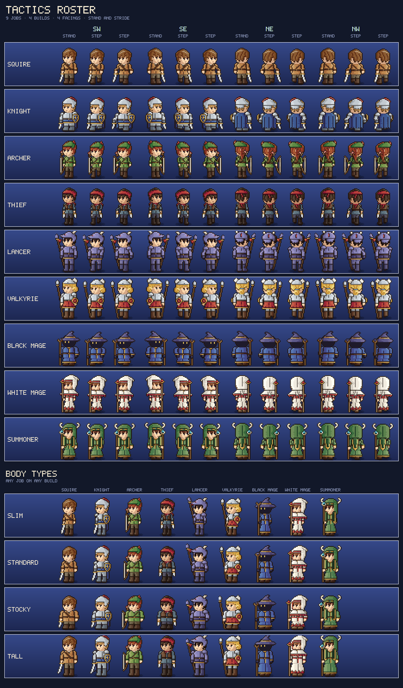

# Tactics sprite sheet

A second character style, built from scratch and separate from the map's townsfolk (see
[character-design.md](character-design.md)). It follows the squad tacticians of the 1990s, Final Fantasy
Tactics and Tactics Ogre: chunky, big-headed figures that read by silhouette across a battlefield, painted in
hue-shifted ramps with a dark umber outline. The code lives in `src/tactics/`.



## The roster

Each job has a default build (in brackets below); any job can be drawn in any of the four.

| Job | Read at a glance by |
| --- | --- |
| Squire (standard) | Short hair, a tan padded jerkin with a cross-strap, a sword held point-down. The plain starting job. |
| Knight (stocky) | A plumed helm, plate with pauldrons, a blue tunic skirt, a kite shield with a gold cross, a long blue cloak behind. |
| Archer (slim) | A green feathered cap, an auburn ponytail down her back, a quiver slung across her back, a recurved longbow held at her side. |
| Thief (slim) | A red bandana with trailing knot, a red scarf, a dark leather vest over slate, a dagger in each hand. |
| Lancer (tall) | An indigo dragon helm with a snout and swept-back horns, indigo plate, a lance carried at the ready flying a red pennant. |
| Valkyrie (tall) | A winged silver helm, gold hair in a low braided bun, plate over crimson skirts, a spear and a round buckler. |
| Black Mage (stocky) | A wide-brimmed pointed hat with a flopped tip, a face of pure shadow with two glowing eyes, a blue robe, a crooked staff. |
| White Mage (slim) | A white cowl whose peak droops back like a nightcap, a red band framing her face, a mantle and robe hemmed in red teeth, a staff with a red orb in a gold cup. |
| Summoner (standard) | A moss-green cowl banded in gold with a jewel at the brow, ram's horns curling from its temples, gold-edged lappets down her chest and a long tail down her back; a rod with a blue crystal in bone claws. |

## Format

- **Frame.** 32×48 pixels. Every build stands with its soles on row 46, so figures line up on a battlefield;
  the rows above the tallest head leave room for plumes, horns and polearms.
- **Proportions.** The head is 14 pixels wide on every build and about as tall as the torso: roughly three
  heads to the figure, the squat, readable build of the genre.
- **Facings.** Two are drawn: front (south-west, three-quarters on, the face to the viewer's left) and back
  (north-east). South-east and north-west are mirror images, as in the games. Both drawn views keep the near
  shoulder on the right, so a weapon in the right hand is on the far side from the front and the near side from
  behind, and a shield on the left arm the other way round.
- **Poses.** Standing and two strides. In a stride the body drops a pixel, one leg reaches forward and the other
  lifts its heel, and each arm swings against its leg; held weapons and shields move with their hand.

## Body types

Four builds, set by a handful of measurements in `body.js` (`BODY_TYPES`):

| Build | Torso, legs (rows) | Shoulders, waist (px) | Legs, arms (px wide) | Height over standard |
| --- | --- | --- | --- | --- |
| Slim | 12, 13 | 10, 8 | 3, 2 | +1 |
| Standard | 12, 12 | 12, 10 | 4, 3 | 0 |
| Stocky | 12, 9 | 14, 13 | 5, 4 | −3 |
| Tall | 14, 15 | 13, 11 | 4, 3 | +5 |

- **Generated body.** The torso, arms, legs, robe skirts and cloaks are cut from these numbers rather than drawn
  as fixed grids. Clothing is a set of rules over the cut shape: where the collar, belt, breastplate ridge or
  robe panel falls, an open vest, a strap from shoulder to hip, a skirt carried below the hem, a vandyked
  robe hem.
- **Hung on landmarks.** The hand-drawn parts (heads, hair, hats, hoods, quivers, scarves, pauldrons, weapons,
  shields) were drawn once, against the standard build. Each hangs on a landmark: the head, the neck, a
  shoulder or a hand. It moves with that landmark on any other build.
- **Weapons.** Each weapon is made for the fist that holds it (see Weapons below), so it fits any build and
  pose.

`render(job, build)` draws a job in any build; `render(job)` uses its own.

## Arms

- **Shape.** Each arm hangs from a fixed shoulder: a rounded cap, the upper arm overlapping the torso's edge by
  one column, an elbow where it steps a pixel further out, the forearm, a cuff and a fist. The fist's thumb is
  on the side the figure faces. A slim build has two-pixel arms and fists.
- **Reading as limbs.** The arm sits in front of the body as its own piece, so it gets a contour line. Below
  the elbow a gap opens between forearm and waist. Both hands hang clear of the body on every build.
- **Swing.** In a stride each arm swings from the shoulder. The leading arm's hand reaches two pixels toward the
  facing, the trailing one falls back a pixel, and both rise a row as the arm leaves the vertical. The shoulder
  only rides down with the body. An arm carrying a staff or polearm stays upright and does not swing.
- **Materials.** Gauntlets take their own darker steel (`D`) against plate sleeves.

## Faces

Skin is cel-shaded as solid shapes rather than lit pixel by pixel, which had left faces mottled:

- **Two tones.** Uppercase `K` is one flat lit tone, lowercase `k` one shadow tone, both from the skin's ramp.
- **A drawn shadow.** The head grid places the shadow as a shape: the far cheek as the face turns from the light,
  the side of the nose, the underside of the jaw and the neck. Wherever hair, a brim or a hood hangs over the
  skin, the frame adds a one-pixel shadow band that follows its edge.
- **Features.** Each eye is a two-pixel lid over a pupil and its white, under a two-pixel brow; the mouth is a
  short dash. Hands take the same two tones, the fist's lower knuckles in shadow.

Skin is also never inked at its edges, so the face stays one clean shape and the hair or brim beside it carries
the line.

## Hair

Four hairstyles, all drawn in locks, front and back:

- **Short** (squire, knight, thief, lancer, white mage): a crown, a pointed fringe and points at the nape.
- **Long** (summoner): falls behind the shoulders in vertical locks, its near lock beside the cheek.
- **Ponytail** (archer): the short crown and fringe, gathered at the back of the head with a leather band. In
  front the tail stays hidden behind the head; from behind it falls down the back, over the quiver.
- **Low bun** (valkyrie): a side-parted fringe swept back across the brow, the sides smoothed back behind the ear,
  and every strand drawn down to a round braided knot at the nape, tied with a blue band. In front the knot peeks
  out behind the head; from behind it sits at the nape. It keeps tight to the head on every build, clear of her
  spear on both sides.

A style may add a piece drawn over what is slung on the back (`over`, the ponytail over the quiver). The details:

- **Strand lines.** Each lock is parted from the next by a solid line in the hair's deepest tone (`Q`, the same
  as the brows). In front they sweep down toward the facing; from behind they fall from the crown.
- **Sheen.** An arc of light (`I`, the hair's highlight lifted toward warm white) runs across the crown on the
  upper left, where the light catches it.
- **Shape.** The fringe hangs in pointed locks over the brow, inked along its lower edge. Short hair ends in
  points at the nape; long hair falls behind the shoulders in vertical locks that end in points, its near lock
  hanging beside the cheek, clear of the eye.

Both marks come from the job's own hair colour, so the same grids serve every hair colour. Under helms, hats and
bandanas the hair still shows its locks where it is uncovered.

## Hoods

The hooded jobs wear two pieces: a fitted cowl over the head (the hat slot) and what falls from it over the
shoulders (the mantle slot, drawn over the arms, so the arms come out from under it).

- **White mage.** A rounded cowl whose peak droops off the back of the head like a nightcap. A red band frames
  the face over the cowl's shadowed lining and closes under the chin. A mantle slopes from the neck over the
  shoulders, closed with a gold clasp and hemmed in red teeth. From behind, a seam runs up the cowl and its peak
  trails down the back as a tail ending in red.
- **Summoner.** A round cowl banded in gold at the brow, with a jewel at its centre. Ram's horns grow from its
  temples and curl up and back. Two gold-edged lappets hang down her chest to the belt, and from behind a long
  gold-edged tail falls to the small of the back.

## Weapons

Weapons are made for the hand that holds them (`make({ hand, dir })` in `parts.js`): the fist's centre and its
outward side. So a weapon sits in the fist on any build and in any pose, and stays clear of the body.

- **Sword and dagger.** A crossguard under the fist and a two-pixel blade angling out from the body a pixel
  every three rows to a point, in its own bright steel (`Y`) so it never reads as more arm. The sword is ten rows
  long and the dagger three. The thief carries a dagger in each hand.
- **Lance.** Carried at the ready: the shaft runs through the fist with its head raised forward and out, clear
  of the helm, and its butt trails toward the ground behind the legs. A leaf-shaped steel head sits on a gold
  socket with a red pennant tied below it. The slant tightens if the head would leave the frame.
- **Bow.** Held by its leather grip, with the limbs sweeping outward to the tips and the string straight
  between them, all clear of the body.
- **Staves** (`staff()`: the valkyrie's spear and the mages' staves). A staff stands beside the fist with its foot
  on the ground on every build.
  - **Mages:** the staff stands upright and is held a little forward, drawn over the hood and mantle with the
    gripping fist drawn again over the shaft, so its head never hides behind headgear. Where its head would
    reach across the face (on a narrow build), it rides above the brow instead.
  - **Valkyrie's spear:** held in the hand like any weapon, so her hair covers the shaft. It leans outward a pixel
    every five rows through the fist, so the head rises clear of her hair in front and of the helm's wings behind.
- **Layering.** From behind, a weapon in the near hand is on the figure's far side, so the back, the hair and the
  arm all cover it.
- **Steady.** An arm carrying a staff or polearm stays upright and does not swing.

## How a sprite is made

Every part is a hand-drawn grid of material letters (`K` skin, `H` hair, `A` main cloth, `S` steel and so
on; the full list is at the top of `parts.js` and `roster.js`). Uppercase is the material as lit, lowercase
the same material in a crease: a fold, a seam, the line between two plates.

- **Body.** `body.js` cuts the torso (tunic, plate or robe), arms, legs or robe skirt and cloak for the build
  and pose, and reports the landmarks.
- **Shared parts.** `parts.js` holds the head, two hairstyles and the gear: sword, dagger, lance, bow and a
  `staff()` maker for spears and staves, a kite shield and a buckler. `recolor()` swaps letters.
- **Jobs.** `roster.js` gives each job a build, an outfit (torso and leg style, sleeves, gauntlets, vest,
  strap, skirt, cloak), a palette, and parts in fixed slots, back to front: the cloak, things behind the body,
  the far arm, legs, torso, what is worn over it, head, hair, hat, the near arm, a mantle, a staff and the fist
  that grips it, and what the other hand holds. Jobs draw their own headgear and anything unique (the hoods, the
  archer's quiver, the black mage's shadow face).
- **Shading** (`pixels.js`). Each colour becomes a five-step ramp in OKLCH, so pale and dark colours darken
  evenly. Highlights lean warm toward gold and shadows cool toward violet. Each pixel's step comes from light at
  the upper left. The figure turns like a cylinder across its width, tops facing the sky catch light, and
  anything tucked under hair, a brim or a belt falls into shade.
- **Line work.** Solid ink throughout, in strengths set by `INK` in `pixels.js`:
  - **Outline:** a near-black umber all round, only a touch warmer above and to the left where the light falls.
    Diagonal corners are left open so curves stay round.
  - **Contours:** where one part stands in front of another (an arm against the body), the part behind gets a
    dark line. The head, its hair and its hat count as one piece, as do a torso and what is worn over it.
  - **Edges:** within one piece, wherever a material ends against another below it or to its right, its last
    pixel is inked: the fringe against the brow, a brim against the face, a vest against the shirt, a plate
    against the tunic. A run only one pixel deep (a belt, a trim) keeps its colour. Skin is never inked at its
    edges, so faces stay clean and the hair or brim beside them carries the line.
  - **Creases:** lowercase letters (folds, seams, the ridge of a breastplate) are inked as lines rather than
    shaded.
- **Flat marks.** Eyes, the eye white, the black mage's shadow and his glowing eyes take no light. So do the
  hair's strand lines and sheen (below).

## Building it

```sh
npm run sheet                 # docs/images/tactics-sprite-sheet.png
npm run sheet -- --strips     # also docs/images/tactics/<job>.png
npm run sheet -- --scale=6 out.png
```

The sheet is laid out like a tactics game's unit menu: a blue window per job with its name, then the four
facings, each standing and in both strides, over a stepped ground shadow. Below that, a window per build shows
every job standing in it. The labels use a 5×7 pixel font
(`font.js`). A strip is one job's six drawn frames at 1×, left to right: front standing, front strides, back
standing, back strides, 32×48 each on a clear background, ready to slice into a game.

Everything is plain JavaScript with no DOM and no dependencies; `tools/png.mjs` writes the PNG with Node's own
zlib. `src/tactics/tactics.test.js` (under `npm test`) checks that every part is rectangular, every frame
stays inside 32×48 in every build, every letter a job draws has a colour, the strides and views differ, the
builds differ in height and breadth on one ground line, and hands hang clear of the body and swing in a stride.
It also checks that faces are solid two-tone shapes showing both whole eyes on every build and in every pose,
every weapon shows and sits in its fist and never shows through hair, the valkyrie's spear keeps clear of her helm, staves stay upright and reach the ground, the outline is dark all round,
hair carries strand lines and sheen, ramps darken step by step, and the sheet encodes to a valid PNG.

## Not yet done

- The tactics figures are not in the tile editor's character library. Its sprites are 32×32 with one fixed
  look, so bringing these in needs either a second sprite kind or a 32×48 library format.
- There are no attack, cast or hurt poses yet.
